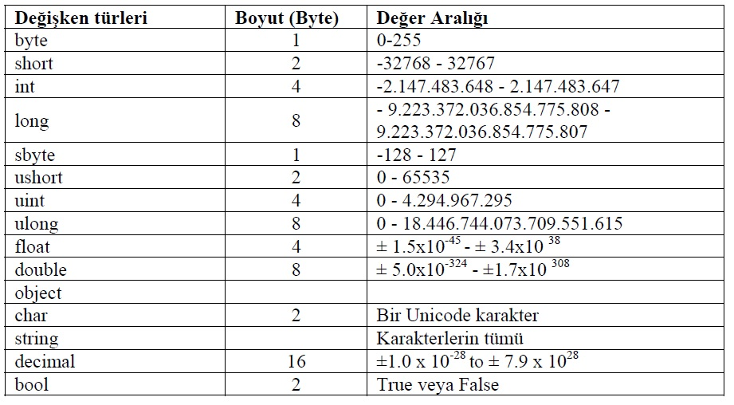

# C# Değişkenler
- Değişkenler,verilerin geçici süreliğine depolandığı yerdir.Değişkenler içine verilerimizi istediğimiz şekilde koyabilir,bu verileri istediğimiz yerde çağırabilir ve kullanabiliriz.

- C# programlama dilinde değişken tanımlarken o değişkenin tipinide belirtmeniz gerekiyor.Değişkenin tipini belirleyen faktörler,içlerindeki verilerin çeşitleridir.



- Değişken Tanımlamanın Formülü
    * DegiskenTipi + DegiskenAdi ;

- sizeOf(byte) =byte tipinin RAM de kapladığı alan.(byte cinsinden)

```C#
string metin = "";
metin += "Musa UYUMAZ \n";
metin += "Fenerbahçeli \n";
metin += "Yazılımcı";
metin += "Eskişehir";
Console.Write(metin);
Console.Read();
```

## Sabit Değişkenler

- Sabitler(constants), program içerisinde değeri bir kere verilen ve tekrar değiştirilemeyen yapılardır. Normal değişken gibi tanımlanır, başına const ifadesi eklenir.

```C#
const int age = 10;
```