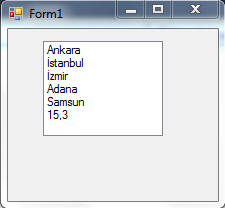

# C# ListBox ve ComboBox Kontrolleri
- ListBox ve ComboBox kontrolleri, içinde bulunan elemanları listeleybilen kontrollerdir.Collection yapısındadırlar. Collection yapısında nesneler birden çok veri alabilirler ve bu verilere indeks no verilir.İndeks numaraları 0 dan başlar. Bu nesnelerin üzerindeki küçük oka “Smart Tag” denir. ComboBox ve ListBox kontrollerinin bütün özellikleri aynı olduğundan dolayı herşeyi ListBox üzerinden anlatacağım.Anlatılan herşey ComboBox içinde geçerlidir.

## ListBox Kontrolü
- ListBox nesnesi içinde bulunan elemanları listeleyebilen bir nesnedir.Items bir koleksiyondur(collection) ve buna eleman ekleriz(Add metoduyla).Add metodu içine object tipte değerler verilebilir.

```C#
lsbSehirler.Items.Add("Ankara"); // index : 0
lsbSehirler.Items.Add("İstanbul");// index : 1
lsbSehirler.Items.Add("İzmir"); // index : 2
lsbSehirler.Items.Add("Adana");   // index : 3
lsbSehirler.Items.Add("Samsun");  // index : 4
lsbSehirler.Items.Add(15.3f);   // index : 5
```


```C#
lsbSehirler.SelectedIndex
//ListBox nesnesinde o an seçili olan nesnenin index numarasını verir.
lsbSehirler.SelectedItem
//ListBox nesnesinde o an seçili olan nesnenin kendisini verir.

MessageBox.Show(lsbSehirler.Items[2].ToString());
 
//Yukarıda ki kodun anlamı şudur.İndex numarası 2 olan elemanı MBox'a yazdır.Tabikide index numarasını yazdırmıyor. Direkt kendisini yazdırıyor.Ekranda "İzmir" yazacaktır.
```

- Kısaca şunu söyleyebilirim.Collection yapısında olan nesnelerde köşeli parantez kullanabiliriz([ ]).Örn,Listbox.Items[2]

## ListBox Olayları
- Buradan kullanışlı olduğu bir kaç olayını açıklamak istiyorum.
- `SelectedIndexChanged` = Seçili olan verinin index numarası değiştikçe bu olay gerçekleşir.
- `MouseDoubleClick` = Üzerine çift tıklandığında gerçekleşen olaydır.


## ListBox Özellikleri
- `ListBox1.SelectedIndex` = 0; = ListBox1 de index numarası 0 olan veriyi seçer.
- S`electionMode`=ListBoxların SelectionMode özelliği default olarak “One” dır.Bundan dolayı ListBox içinde birden fazla veri seçemeyiz.Eğer SelectionMode özelliğiyle oynanırsa,birden fazla veri seçebiliriz.
- `ListBox1.Sorted = true;`  = ASCII karakter kod karşılıklarına göre sıraya sokar

```C#
listBox1.SelectionMode = SelectionMode.One;
//Tek seçimlik ListBox
listBox1.SelectionMode = SelectionMode.MultiSimple;
//Fareyle birden fazla veri seçebiliriz.
listBox1.SelectionMode = SelectionMode.MultiExtended;
//Fareyi oynatarak verileri seçebiliriz.
```


```C#
//Ayrıca bu ayarlar Properties penceresinden manuel olarakta yapılabilir. MultiColumn = ListBox’ın bu özelliğini “True” yaparak,elemanların birden fazla sütunda gösterilmesi sağlanabilir.Properties penceresinden manuel olarak ayarlayabilirsiniz.

listBox1.MultiColumn = true;
```

## ListBox Metodları
- `listBox1.Items.Count` = ListBox’un Items koleksiyonunda ki eleman sayısını verir.
- `listBox1.Items.RemoveAt(2)` = ListBox’un index’i 2 olan elemanı kaldırır.
- `listBox1.Items.Remove(“İzmir”);` = ListBox’un içinden “İzmir” elemanını kaldırır.
- `listBox1.Items.Remove(lsbSehirler.SelectedItem);`=Seçili olan elemanı kaldırır. Burada index yoktur.
- `listBox1.Items.Remove(lsbSehirler.SelectedItem.ToString());` =Bu şekilde ToString() metoduolursa,seçilen nesne sadece string olmalıdır.Aksi halde int gibi değerlerde silme gerçekleşmiyor.
- `listBox1.Items.Clear();` = ListBox’un içindeki bütün elemanları siler.
- `listBox1.Items.IndexOf(txtAranacakKelime.Text);` = IndexOf() metodunun içine verdiğimiz değer listBox’un items koleksiyonunda aranıyor ve eğer bulunursa o elemanın indeks nosunu geri döndürüyor.Eğer yoksa “-1” geri döndürüyor.
- `listBox.Items.Insert(2,”Metin”);` = Bu metod istediğimiz indexe eleman eklemeye yarar.İki parametreden oluşur.İlk parametre eklenecek index numarasını ister,ikincisi ise eklenecek object tipteki veriyi.