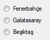

# C# RadioButton ve CheckBox Kontrolleri
- Genel anlamda birden fazla seçeneklerle işimiz olduğu zaman kullandığımız kontrollerdir.

## RadioButton Kontrolü
- Birden fazla seçenek arasında sadece tek bir tanesini seçmemize yarayan kontroldür.



```C#
radiobutton.Checked=True & False ;
//True ise seçili,False ise seçili değil

//CheckAlign özelliği ile yuvarlak butonun konumunu belirleyebiliyoruz.Properties penceresinden ayarlama yapabiliyoruz.Ayrıca kod kısmında şu şekilde değiştirebiliyoruz.

radioButton1.CheckAlign = ContentAlignment.MiddleRight;
//V.S MiddleRight yerine diğer konumları derleyici size verecektir.
````

- `CheckedChanged` olayı sayesinde radiobutton tıklandığında meydaha gelecek kodlar çalışır.
## CheckBox Kontrolü
- Birden fazla seçenekler arasından bir çok seçenek seçmenizi sağlar.
- RadioButton ile özelikleri bire bir aynıdır.